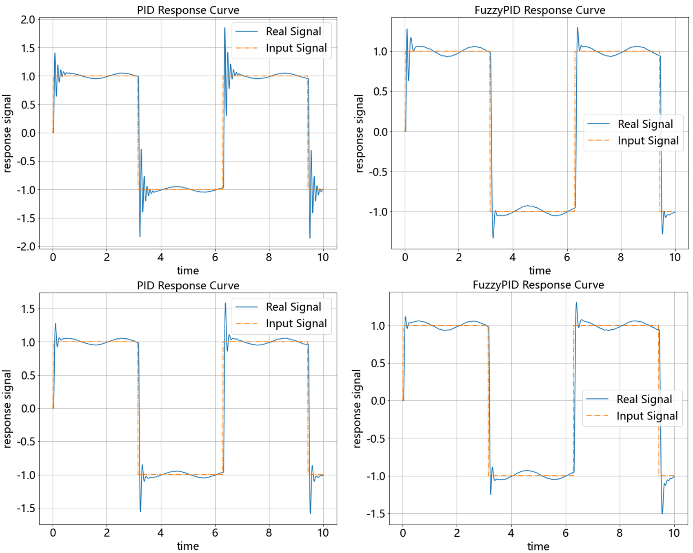
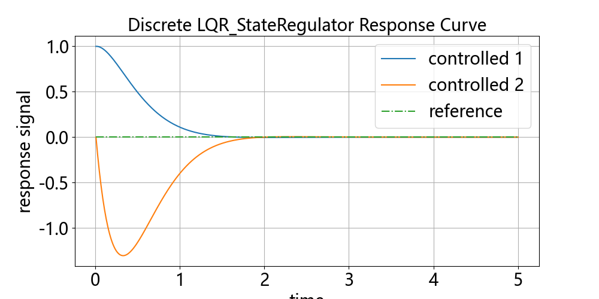
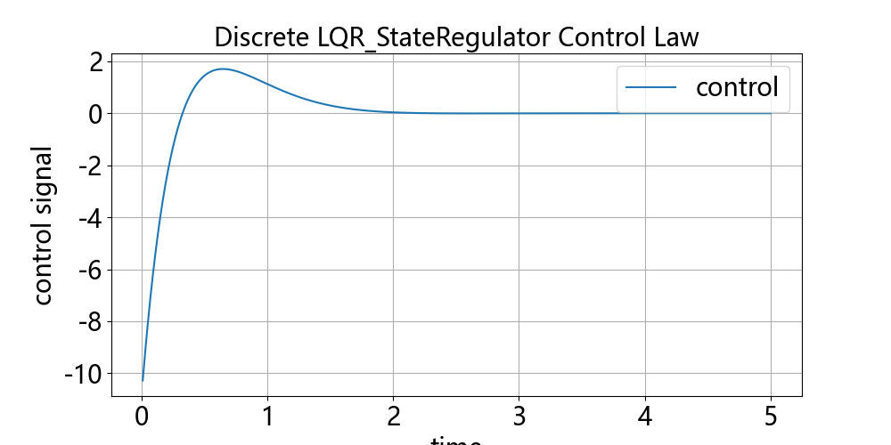
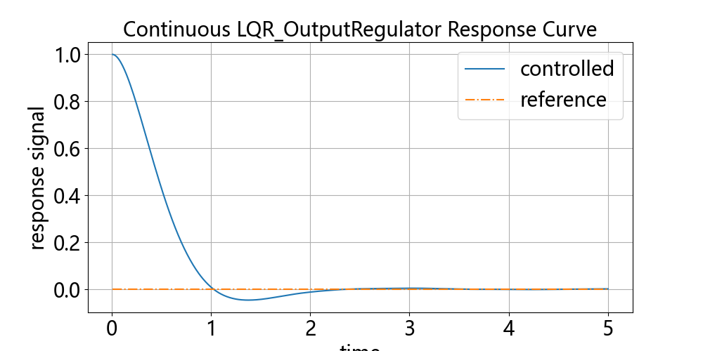
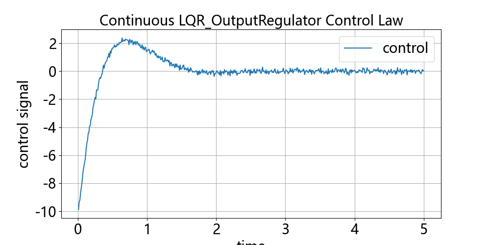
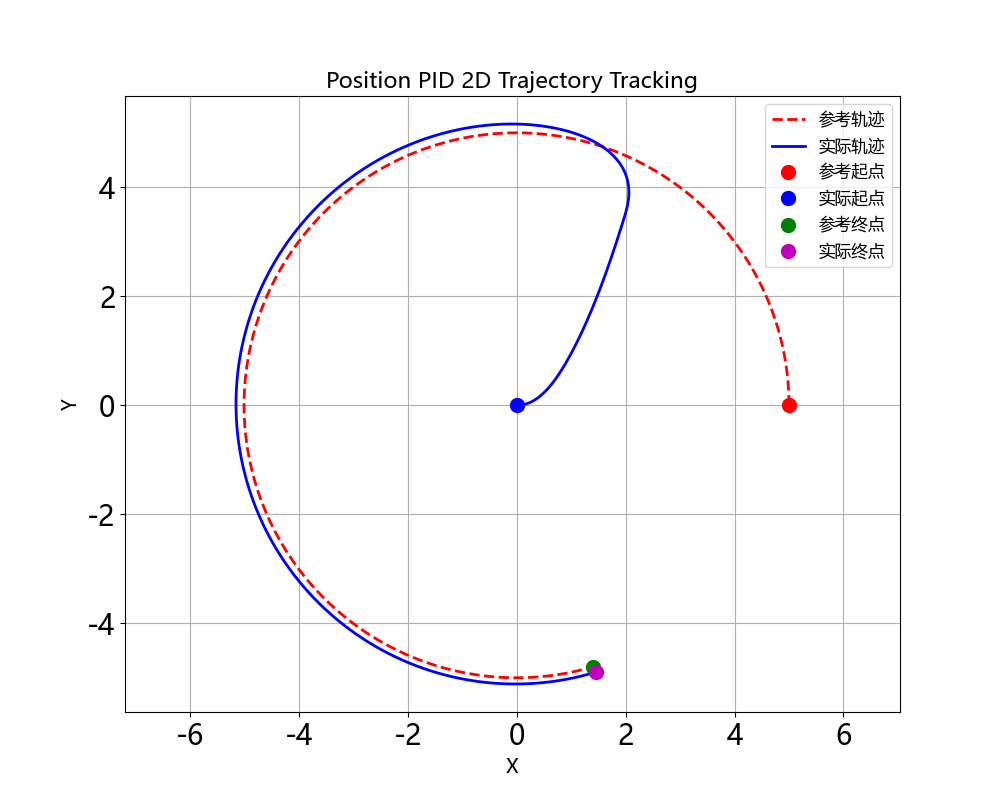

# Control Algorithm

## 一、控制算法:

变量符号约定:
v: 参考点或参考轨迹
y: 系统输出（观测）
x: 系统状态（当无法得到时需设计观测器）
u: 控制量


### 1.无模型

| 算法名                                                 | 类名         | 输入 | 输出 | 备注                 |
| ----------------------------------------------------- | ------------ | ---- | ---- | -------------------- |
| 先进PID控制 <br /> Proportion Integral Differential    | PID          | y、v | u    | 自带先进PID功能      |
| 增量式PID控制 <br /> Increment PID Control             | IncrementPID | y、v | u    | 自带先进PID功能      |
| 自抗扰控制 <br /> Active Disturbance Rejection Control | ADRC         | y、v | u    | 缺点：参数巨多。。。 |

### 2.基于模型

基于模型进行优化控制

| 算法名                                                         | 类名                   | 输入   | 输出  | 备注                     |
| -------------------------------------------------------------- | --------------------- | ----- | ----- | ------------------------ |
| 线性二次型调节器 (状态调节版) <br /> Linear Quadratic Regulator   | LQR_StateRegulator   | x     | u    | 线性时不变系统，要求能控     |
| 线性二次型调节器 (输出调节版) <br /> Linear Quadratic Regulator   | LQR_OutputRegulator  | x     | u    | 线性时不变系统，要求能控能观 |
| 线性二次型调节器 (输出跟踪版) <br /> Linear Quadratic Regulator   | LQR_OutputTracker    | x、v  | u    | 线性时不变系统，要求能控能观 |
| 时变线性二次型调节器 <br /> Time-Varying Linear Quadratic Regulator | TVLQR             | x、v  | u    | 线性时变系统                |
| 迭代线性二次型调节器 <br /> Iterative Linear Quadratic Regulator  | iLQR                | x、v  | u    | 非线性系统              |
| 模型预测控制 <br /> Model Predictive Control                     | MPC                 | x、v_seq | u    | 非线性系统<br />缺点：计算慢，且需要知道未来n步的v  |

### 3.智能控制 (基于仿真)

#### 3.1强化学习 (未实现)

仿真环境用来产生训练数据

| 算法名                                      | 类名 | 输入 | 输出 | 备注                    |
| ------------------------------------------ | ---- | ---- | ---- | --------------------- |
| SAC算法 <br /> Soft Actor-Critic            | SAC  | y、v | u    | 收敛快                  |
| PPO算法 <br /> Proximal Policy Optimization | PPO  | y、v | u    | 收敛慢，但稳的一批       |

#### 3.2启发搜索（未实现）

仿真环境用来评估搜索解的好坏
原理类似MPC，直接搜索u_seq，u_seq带入环境模型评估搜索结果，利用启发算法优化，执行u_seq[0]，下一时刻重新搜索

| 算法名                       | 类名           | 输入     | 输出 | 备注                                                                                                                      |
| ---------------------------- | ------------- | -------- | ------ | ---------------------- |
| 启发搜索算法 <br /> Heuristic Search | PSO等动物园算法 | x、v_seq | u    | 缺点：速度巨慢（很多学阀喜欢用启发算法冒充AI骗经费，群体智能也是智能[狗头]） |

### 4.模糊控制

| 算法名                              | 类名     | 输入 | 输出 | 备注              |
| ----------------------------------- | -------- | ---- | ---- | ----------------- |
| 模糊PID控制 <br /> Fuzzy PID Control | FuzzyPID | y、v | u    | 模糊规则给PID调参 |

## 二、控制器接口:

状态/输出跟踪器：
输入为 x | y 和 v，输出为 u

状态/输出调节器：
输入 x | y，v为None，输出为 u


#### 1.控制器输入：

| 输入  | 定义             | 向量情况(ndarray)  | 标量情况(ndarray/float) |
| ----- | --------------- | ------------------ | ----------------------- |
| v     | 参考点           | shape = (dim_v, )  | shape = (1, ) / float  |
| v_seq | 参考轨迹片段     | shape = (n, dim, ) | shape = (n, )           |
| y     | 系统输出（观测）  | shape = (dim_y, )  | shape = (1, ) / float  |
| x     | 系统状态         | shape = (dim_x, )  | shape = (1, ) / float  |

#### 2.控制器输出：

当前时刻的控制量u，形状为(dim_u, )的向量（一维ndarray），无论x、y、v是否为标量，输出u都是向量，即使dim_u=1时也不输出float


#### 3.控制器参数：

控制器参数设置成float时，将自动广播成向量或者对角矩阵

对于SISO控制器，超参数为float；当dim_u>1时，也可设置为向量（设置成一维list或ndarray），为每个u的维度单独调参

对于MIMO控制器，超参为矩阵 (设置成二维list或ndarray)

对于AI控制器，超参为AI算法超参(float)，和控制无关

## 三、用法示例:

### 1.SISO控制器示例：

```python
import numpy as np
from controller.siso import PIDConfig, PID
from controller.utils import matplotlib_context
# 设置控制器
dim = 2 # SISO需要指定信号维度, 每个维度控制器独立
cfg = PIDConfig(dt=0.1, dim=dim, Kp=[5,6], Ki=0.1, Kd=1) # 调参
pid = cfg.build() # 实例化控制器
# or: pid = PID(cfg)
print(pid) # 打印控制器参数
# 生成输入信号
t_list = np.arange(0.0, 10.0, dt=cfg.dt)
v_list = np.ones((len(t_list), dim)) # 需要跟踪的信号 v: (dim, )
# 被控对象
def dynamics(y, u, dt=cfg.dt):
    ...
    return y
# 仿真
y = np.zeros(2) # 被控信号初值
for v in v_list:
    u = pid(y, v) # 第一个为实际值, 第二个为参考值（调节器为None）
    y = dynamics(y, u) # 更新被控信号
# 绘图输出
with matplotlib_context():
    pid.show(save_img=True)
```

### 2.MIMO控制器示例：

```python
import numpy as np
from controller.mimo import LQR_StateRegulator
from controller.utils import matplotlib_context
# 线性系统
A = np.array([[0, 1], [0, 0]])
B = np.array([[0], [1]])
dt = 0.01
max_steps = 1000
# 设置控制器，MIMO根据模型自动推断维度
Q = 2 # 设置为float时，自动广播成对角矩阵
R = 0.1
lqr = LQR_StateRegulator(A, B, Q, R, dt=dt, discrete=False)
print(lqr) # 打印控制器参数
# 仿真
x = np.zeros(2) # 被控信号初值
for _ in range(max_steps):
    u = lqr(x) # 第一个为实际值, 第二个为参考值（调节器为None）
    x = A @ x + B @ u # 更新被控信号
# 绘图输出
with matplotlib_context():
    lqr.show(save_img=True)
```

### 3.AI控制器示例：

尚未实现


## 四、控制器效果图:

#### 1.PID控制算法：

参数忘了。。。


#### 2.ADRC控制算法：


#### 3.模糊PID控制算法：

两组对比图参数分别为Kp=5,Ki=0,Kd=0.2和Kp=5,Ki=0,Kd=0.1



#### 4.LQR控制器：

##### LQR状态调节器





##### LQR输出调节器（基于状态反馈控制，需要设计状态观测器）



示例使用带噪声的状态假装观测结果，因此u有抖动，实际u的好坏取决于观测器好坏



## 五、小车位置跟踪控制:



## 六、无人机位置跟踪控制：


